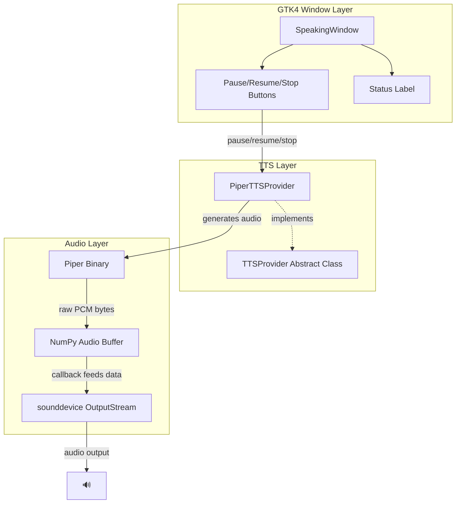
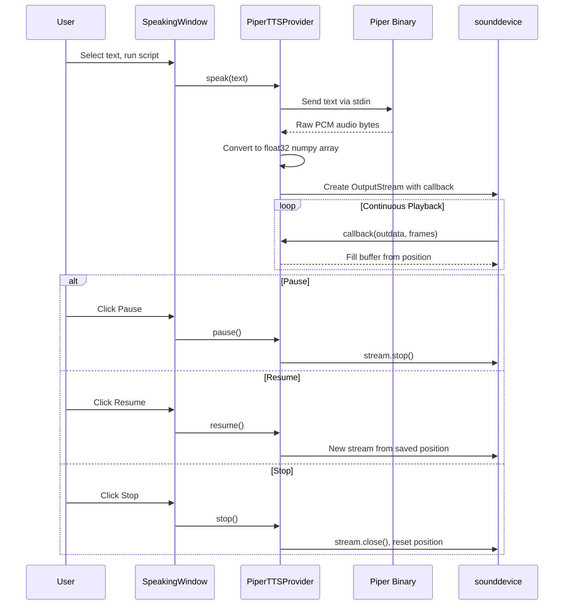

# TTS Architecture

## Overview

A text-to-speech system with pause, resume, and stop controls using Piper TTS and a GTK4 floating window interface.



## File Structure

| File | Purpose |
|------|---------|
| `tts_interface.py` | Abstract base class defining the TTS contract |
| `tts_piper.py` | Piper implementation with sounddevice playback |
| `speak_with_window.py` | GTK4 UI with controls |
| `speak-selection` | Entry point script |

## Data Flow



## Key Components

### 1. TTSProvider (Abstract Interface)

Defines the contract for any TTS implementation:

```python
class TTSProvider(ABC):
    def speak(text) -> None      # Start speaking
    def pause() -> None          # Pause playback
    def resume() -> None         # Resume from position
    def stop() -> None           # Stop and reset
    def is_playing() -> bool     # Currently playing?
    def is_paused() -> bool      # Currently paused?
```

### 2. PiperTTSProvider (Implementation)

**Audio Generation:**
- Spawns Piper subprocess with text
- Reads raw PCM audio (16-bit, 22050 Hz, mono)
- Converts to float32 numpy array for sounddevice

**Playback with OutputStream:**
- Uses callback-based streaming (no gaps)
- Callback fills audio buffer continuously
- Tracks `_playback_position` for pause/resume

**State Management:**
- `_is_playing`: Stream is active
- `_is_paused`: Intentionally paused (position preserved)
- `_playback_position`: Current sample index in buffer

### 3. SpeakingWindow (GTK4 UI)

- Floating borderless window
- Status label: "Preparing...", "Speaking...", "Paused"
- Control buttons that call provider methods
- Timer polls `is_playing()`/`is_paused()` to update UI
- Auto-closes when playback finishes

## Why OutputStream Callback?

The callback approach provides smooth audio:

- **One continuous stream** - no gaps between chunks
- **sounddevice calls us** when it needs data
- **We fill the buffer** from our current position
- **Smooth, uninterrupted audio**

Alternative approaches like chunked `sd.play()` calls create gaps between chunks, resulting in choppy audio.

## Dependencies

- `piper-tts` - TTS engine
- `sounddevice` - Cross-platform audio playback
- `numpy` - Audio data handling
- `PyGObject` - GTK4 bindings
- `pycairo` - Cairo graphics (GTK dependency)

